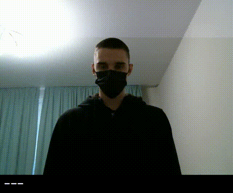

# SilkSign (Ishora)

*[Oʻzbekcha](README.md)*

**SilkSign** is a prototype that converts sign language into text in real time: a camera captures a gesture, an ONNX model classifies it, and the recognized word is displayed on screen.

The web interface is called **Ishora** and runs in the browser: video from the webcam is sent to the server over WebSocket, where frames go through the same preprocessing and model used by the CLI demo.



## ⚠️ Important note: this is not real Uzbek Sign Language

The current model was **not trained on Uzbek Sign Language (UzSL)**. It is a baseline (MViTv2) trained on the [Slovo](https://github.com/hukenovs/slovo) dataset — video samples of **Russian Sign Language (RSL)** — and partly on **SignFlow-A** (WLASL-2000, American Sign Language). The 1000 classes in `constants.py` are exactly those same RSL/ASL class names, just **translated as text into Uzbek** (e.g. the Russian "бегемот" now shows up as "begemot"), but the hand gestures the model actually recognizes are unchanged — they are still RSL/ASL gestures.

Uzbek Sign Language is an **entirely distinct** language from RSL and ASL, with its own grammar and its own set of signs. Because of this, the system currently does **not** recognize someone using real Uzbek Sign Language — it only recognizes RSL/ASL gestures and displays the result as an Uzbek word.

This is a **proof-of-concept / technical foundation**, not a finished product. To actually recognize Uzbek Sign Language, the model would need to be retrained (or at least fine-tuned) on video data collected from Uzbek Sign Language speakers. The `zametka.txt` file notes the same thing: "The model needs to be improved."

## How it works

1. The browser captures frames from the webcam and sends them as base64 JPEG over WebSocket (`/ws`).
2. The server (`server.py`, FastAPI + Uvicorn) decodes the frame, letterboxes it to 224×224, normalizes it, and accumulates a window of `WINDOW_SIZE` frames (32 for the `mvit32-2` model).
3. Once the window is full, it is run through the ONNX model (`onnxruntime`, CUDA if a GPU is available, otherwise CPU).
4. The predicted class index is mapped to a word via `constants.py` (about 1000 classes: fingerspelling letters and words/gestures) and returned to the client along with the accumulated "sentence".

The same preprocessing pipeline is also used in `demo.py` — for browser-less operation with a local webcam (OpenCV window).

## Repository structure

| Path | Purpose |
|---|---|
| `server.py` | FastAPI server: landing page, `/demo` (web client), real-time recognition WebSocket `/ws` |
| `demo.py` | Standalone OpenCV-based CLI demo (no browser), with a multiprocessing option |
| `constants.py` | `classes` dictionary — model index → word/letter (in Uzbek) |
| `config_example.yaml` | Model configuration: weights file path, frame interval, normalization mean/std |
| `web/index.html` | Web client for the recognition demo (camera capture, gesture/sentence output) |
| `Ishora.dc.html` | Project landing page |
| `support.js` | Landing page runtime script |
| `examples/` | Inference (ONNX/Torch) and landmark visualization notebooks |
| `sign language.md` | Investor pitch deck document for the project |
| `license/` | License text (en/ru) |

## Installation

Python 3.9+ is required.

```bash
pip install -r requirements.txt
```

The model file (`.onnx`) is not included in the repository (see `.gitignore`) — download it separately and point the config at its path. The base model is **MViTv2-small-32-2**, trained on the [Slovo](https://github.com/hukenovs/slovo) (Russian Sign Language) dataset; only the output words were translated for Uzbek, the model itself was not retrained (see [Model](#model) and the note above).

Place the downloaded file (e.g. `mvit32-2.onnx`) in the project root and set its name in `config_example.yaml` (`model_path`). If CUDA is available and an `mvit32-2-fp16.onnx` file is found next to it, the server and `demo.py` will automatically use the fp16 version on GPU.

## Running

### Web server (browser WebSocket demo)

```bash
python server.py
```

The server starts on port `8010` by default (override with the `PORT` environment variable).

- `http://localhost:8010/` — landing page
- `http://localhost:8010/demo` — live gesture recognition from the webcam

### CLI demo (local camera, OpenCV window)

```bash
python demo.py -p config_example.yaml
```

```
usage: demo.py [-h] -p CONFIG [--mp] [-v] [-l LENGTH]

  -p, --config    path to the model configuration
  --mp            enable multiprocessing for inference
  -v, --verbose   verbose logging (prediction time, etc.)
  -l, --length    length of the recently recognized words queue
```

Exit with `q`, `Q`, or `Esc`.

## Configuration

`config_example.yaml`:

```yaml
model_path: mvit32-2.onnx
frame_interval: 2   # take every Nth frame for the model
mean: [123.675, 116.28, 103.53]
std: [58.395, 57.12, 57.375]
```

## Model

Recognition is based on the **MViTv2** architecture, used in the [Slovo](https://github.com/hukenovs/slovo) project (dataset and baseline models for Russian Sign Language, [arXiv:2305.14527](https://arxiv.org/abs/2305.14527)) and in the **SignFlow** model (including SignFlow-A, trained on WLASL-2000/American Sign Language).

The class dictionary (`constants.py`) is **only a text translation** of the RSL/ASL classes, adapted into Uzbek: fingerspelling letters and roughly a thousand words. The model itself was not trained on Uzbek Sign Language videos (see the "Important note" section above for details).

## Development

Formatting and linting are set up via `pre-commit` (black, isort, flake8, autoflake):

```bash
pip install pre-commit
pre-commit install
pre-commit run --all-files
```

## License

The project is based on the Slovo dataset and model, distributed under a modified version of Creative Commons Attribution-ShareAlike 4.0. Full text is available in [`license/en_us.pdf`](license/en_us.pdf) and [`license/ru.pdf`](license/ru.pdf).
